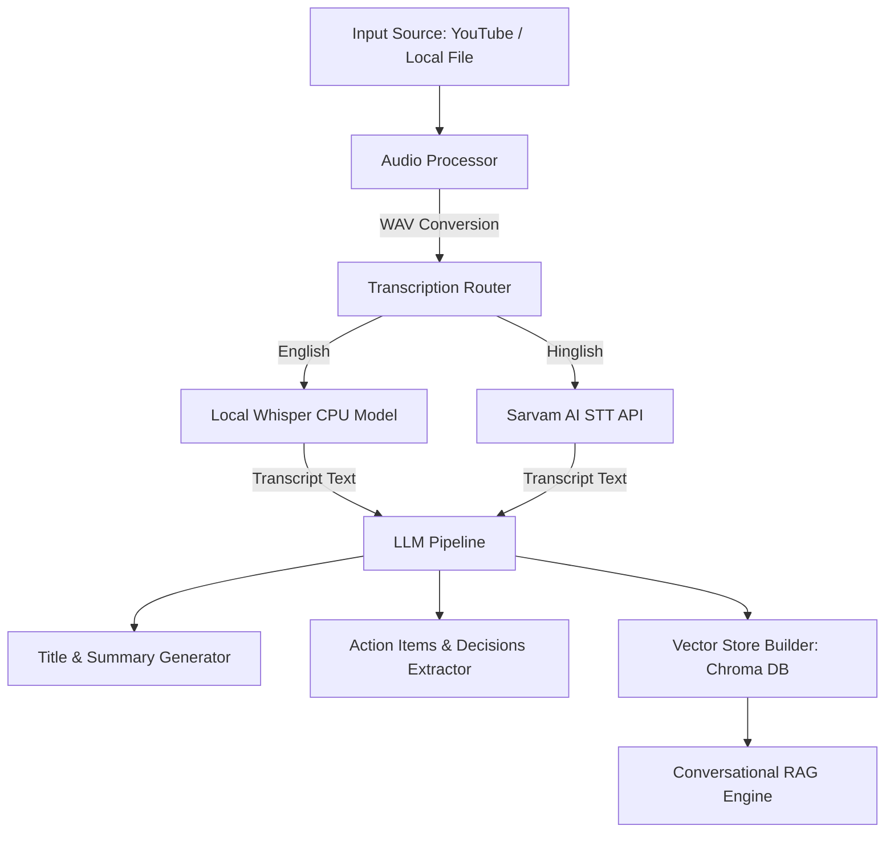

# 🎥 AI Video & Meeting Assistant

An intelligent, state-of-the-art Python tool designed to automate meeting minutes, extract actionable insights, and enable interactive conversation (RAG) with any video or audio file. It supports YouTube URLs, local video files, local Whisper transcription, and Hinglish translation/transcription via Sarvam AI.

---

## ✨ Features

- **📼 Dual Source Input**: Easily ingest local files (`.mp4`, `.webm`, etc.) or download high-quality audio directly from YouTube URLs.
- **🎙️ Advanced Transcription Router**:
  - **English**: Transcribed locally using the lightweight, fast OpenAI Whisper (`tiny`/`small`) model on CPU.
  - **Hinglish / Hindi**: Powered by the high-accuracy Sarvam AI STT Translation API (`saaras:v2.5`).
- **📝 Intelligent Document Extractor**:
  - Automatically generates professional meeting titles.
  - Summarizes partial transcript sections and merges them into a cohesive executive summary.
  - Extracts actionable items with owners and deadlines.
  - Formulates lists of key decisions and unresolved open questions.
- **💬 Chat with your Video (RAG)**:
  - Builds a localized vector database using Chroma DB and Hugging Face Embeddings (`all-MiniLM-L6-v2`).
  - Engage in a conversational Q&A session with the transcription context.

---

## 🛠️ Architecture



---

## 🚀 Setup & Installation

### 1. Prerequisites
- **Python 3.10+**
- **FFmpeg**: Must be downloaded and configured. Ensure the binary path matches `FFMPEG_PATH` in `utils/audio_processor.py`.

### 2. Setup Environment
Install dependencies within your virtual environment:
```bash
# Activate your environment
# Windows (PowerShell):
.\venv\Scripts\Activate.ps1

# Install requirements
pip install -r Requirements.txt
```

### 3. Environment Variables
Create a `.env` file in the root directory (or update the existing one):
```env
MISTRAL_API_KEY="your_mistral_api_key_here"
WHISPER_MODEL="tiny"
SARVAM_API_KEY="your_sarvam_api_key_here"
SARVAM_STT_MODEL="saaras:v2.5"
```

---

## 💻 Running the Application

Run the pipeline directly from your terminal:
```bash
python main.py
```

### Prompt Walkthrough
1. **Enter Input**: Paste a YouTube link or provide a local video filename (e.g., `LangChain Explained in 5 Minutes with Real Life Example in Hindi [hMvZ0CeIZDQ].webm`).
2. **Select Language**: Type `english` or `hinglish`.
3. **Review Results**: The system will print extracted insights.
4. **Chat Interface**: Ask any follow-up questions in the prompt (e.g., *What database did we decide to use?*). Type `exit` to exit.
