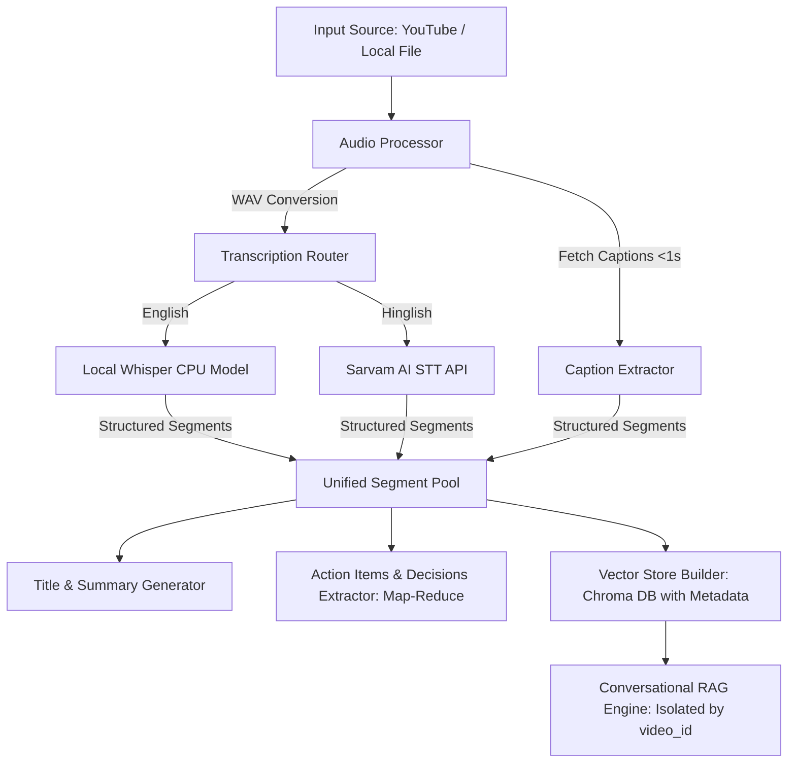

# 🎥 AI Video & Meeting Assistant

An intelligent, production-grade Python tool designed to automate meeting minutes, extract actionable insights, and enable interactive conversation (RAG) with any video or audio file. It supports direct YouTube caption extraction, local WAV conversions, local Whisper transcription, and Hinglish translation/transcription via Sarvam AI.

---

## ✨ Features

- **📼 Dual Source Input**: Ingest local video/audio files or process YouTube URLs.
- **⚡ Direct YouTube Caption Download (Preferred)**: Fetch transcripts directly from YouTube's auto-generated or manual subtitles using `youtube-transcript-api` in **<1 second**, saving massive bandwidth, CPU, and API credits.
- **🎙️ Advanced Transcription Router (Fallback)**:
  - **English**: Transcribed locally using the OpenAI Whisper (`tiny`/`small`) model.
  - **Hinglish / Hindi**: Powered by the high-accuracy Sarvam AI STT Translation API (`saaras:v2.5`).
- **🛡️ Strict Video-Level Isolation**: Retains vector store database index isolation using unique `video_id` metadata filtering, preventing cross-video context leakage in RAG queries.
- **⏱️ Timestamp-Aware Semantic Chunking**: Groups transcript segments by sentence boundaries and pause detections ($\ge 2.0$s) instead of naive character counts. Preserves start/end timestamps and metadata throughout the entire pipeline.
- **💬 Conversational RAG with Citations**:
  - Automatically formats retrieved documents with bracketed timestamps (e.g. `[MM:SS - MM:SS]`).
  - Instructs the LLM to output precise timestamp citations in replies.
- **📝 Context Window Protection (Map-Reduce)**:
  - Processes summarization and extraction (Action Items, Decisions, Questions) for long videos using a robust Map-Reduce chain, avoiding API context limit errors.
- **⚙️ Zero-Config Dependency Resolution**: Dynamically resolves FFmpeg paths from system PATH or environment variables, avoiding brittle local hardcoding.

---

## 🛠️ Architecture



---

## 🚀 Setup & Installation

### 1. Prerequisites
- **Python 3.10+**
- **FFmpeg**: Ensure FFmpeg is installed globally in your system path. If installed globally, it is resolved automatically. Otherwise, you can set the `FFMPEG_PATH` environment variable.

### 2. Setup Environment
Install dependencies within your virtual environment:
```bash
# Activate your environment
# Windows (PowerShell):
.\venv\Scripts\Activate.ps1

# Install requirements
python -m pip install -r Requirements.txt
```

### 3. Environment Variables
Update the `.env` file in the root directory:
```env
MISTRAL_API_KEY="your_mistral_api_key_here"
WHISPER_MODEL="tiny"
SARVAM_API_KEY="your_sarvam_api_key_here"
SARVAM_STT_MODEL="saaras:v2.5"
```

---

## 💻 Running the Application

Run the pipeline directly from your terminal:
```bash
python main.py
```

### Prompt Walkthrough
1. **Enter Input**: Paste a YouTube link or provide a local video filename.
2. **Select Language**: Type `english` or `hinglish`.
3. **Review Results**: The system will print executive summaries, action lists (with owner/deadline), and key decisions.
4. **Chat Interface**: Ask any question in the prompt (e.g. *What did John say about embeddings?*). The engine will retrieve context isolated to this video and citation-stamp the answer (e.g. `[02:00 - 02:10]`).
5. **Exit**: Type `exit` to close the prompt.
